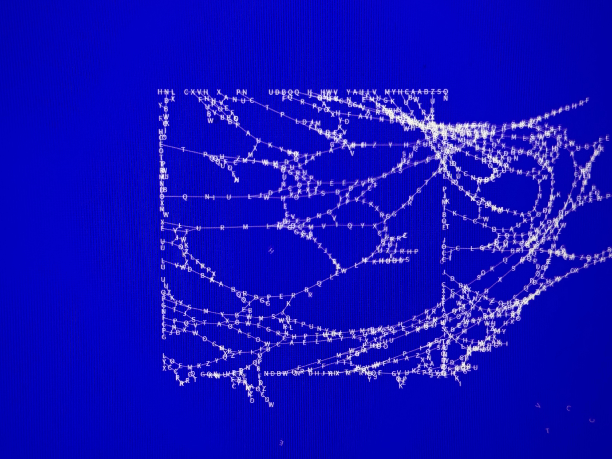

# 🌪️ Wind Letters

> *在数字的风中，字母如落叶般飘散*

---

## ✨ 项目概述

这是一个融合了物理学与视觉美学的交互式数字艺术作品。通过p5.js构建的动态字母网格，模拟了真实世界中风与物质的微妙交互。每一个字母都承载着独立的物理属性，在风的推动下演绎着诗意的飘落。将抽象的字母转化为具有生命力的视觉元素。当风力渐起，网格中的字母开始颤抖、摇摆，最终如秋叶般飘散。这种从秩序到混沌的转变，象征着语言在时间洪流中的流动与变迁。

## 🌊 核心特性

**动态物理引擎**：每个字母节点都拥有独立的位置、速度和加速度，通过弹簧系统相互连接，创造出逼真的布料模拟效果。

**智能风力系统**：风力随时间动态变化，从温和的轻抚到强烈的冲击，影响整个网格的运动状态。风向和强度可自定义调整。

**渐进式衰减**：当网格破损达到临界点时，风力开始自然衰减，营造出从激烈到平静的情感过渡。

**振动控制算法**：通过高频振动检测和低通滤波，确保系统的数值稳定性，同时保持视觉的流畅性。

**连通性检测**：确保网格始终保持结构完整性，只有在不会导致网格断裂的情况下才允许字母脱落。

## 🎯 技术实现

项目采用p5.js作为主要框架，实现了复杂的物理模拟系统。核心算法包括：

- **Verlet积分**：用于位置和速度的数值积分
- **弹簧-质点系统**：模拟网格的弹性行为  
- **噪声函数**：为风力添加自然的随机性
- **自适应阻尼**：根据速度动态调整阻尼系数
- **连通性算法**：使用BFS确保网格结构的完整性

## 🚀 快速开始

1. 在浏览器搜索p5.js在线编译器
2. 运行`wind.js`
3. 观察字母网格在风中的优雅舞动

## 🧭 详细运行指南（小白向）

适合完全没有前端经验的同学。三种方法任选其一：

### 方法一：在线运行（零配置，最简单）
1. 打开 p5.js 在线编辑器（搜索“p5js editor”或访问 `editor.p5js.org`）。
2. 新建项目（File → New）。
3. 打开左侧的 `sketch.js`，把本项目 `wind.js` 的全部代码复制进去。
4. 将 `wind.jpg` 拖拽到左侧文件列表中（用于背景/纹理等资源）。
5. 点击顶部 ▶ Run 按钮即可运行。

小贴士：在线编辑器默认已经引入 p5.js，无需再添加 `<script>`。

### 方法二：本地直接用浏览器打开（快）
1. 在本项目根目录新建一个 `index.html` 文件，并粘贴以下内容：

```html
<!doctype html>
<html lang="zh-CN">
  <head>
    <meta charset="utf-8" />
    <meta name="viewport" content="width=device-width, initial-scale=1" />
    <title>Wind Letters</title>
    <style>
      html,body { margin:0; padding:0; background:#000; }
      canvas { display:block; }
    </style>
    <script src="https://cdn.jsdelivr.net/npm/p5@1.9.0/lib/p5.min.js"></script>
  </head>
  <body>
    <script src="./wind.js"></script>
  </body>
  </html>
```

2. 确保 `index.html`、`wind.js`、`wind.jpg` 在同一文件夹：

```
D:\Work\js_project\
  index.html
  wind.js
  wind.jpg
```

3. 双击打开 `index.html`（推荐用 Chrome/Edge）。若图片未显示或控制台报跨域错误，请使用下面“方法三”。

### 方法三：本地小型服务器（推荐，最稳妥）
在 Windows PowerShell 中进入项目目录后任选其一：

- 若已安装 Python 3：
```powershell
python -m http.server 8000
```
  打开浏览器访问：`http://localhost:8000/index.html`

- 若已安装 Node.js：
```powershell
npx http-server -c-1 -p 8080
```
  打开浏览器访问：`http://localhost:8080/index.html`

### 常见问题（快速排查）
- 空白屏/报错：按 F12 打开“控制台（Console）”，查看报错信息。
- 找不到 p5：确认在 `index.html` 中先引入 `p5.min.js`，再引入 `wind.js`。
- 找不到图片：确认 `wind.jpg` 路径与代码一致（示例中与 `index.html` 同目录）。
- 双击打开没图：使用“方法三”启动本地服务器可避免本地文件跨域问题。

## ⚙️ 自定义参数

在代码顶部，你可以调整以下参数来改变视觉效果：

```javascript
const WIND_ANGLE_DEG = -40;        // 风向角度
const WIND_FORCE = 2;              // 风力强度
const BACKGROUND_COLOR = [65, 10, 235];  // 背景色调
```


*在这个数字诗篇中，每一个字母都是时间的见证者，每一次飘落都是对永恒的诠释。*
